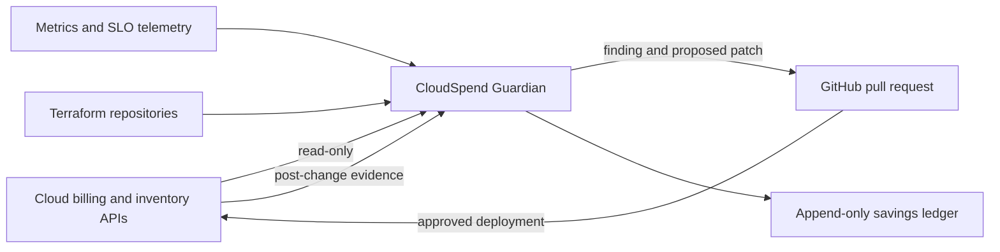

# System context

CloudSpend Guardian sits between cloud billing and observability sources, infrastructure-as-code repositories, and human operators. It is an advisory and governance control plane—not an infrastructure actuator.

## Trust boundaries

1. Provider ingestion accepts externally controlled data and therefore validates schema, provenance, and reconciliation totals.
2. Resource metadata is untrusted and cannot issue instructions to the control plane.
3. GitHub credentials are repository-scoped and short-lived.
4. Remediation output is untrusted until policy, CI, and human review succeed.
5. Savings claims require post-deployment evidence distinct from projections.

## Initial components

- **API:** operational endpoints and, later, human-facing recommendation queries.
- **Ingestion:** replayable provider adapters and synthetic fixtures.
- **Normalization:** provider records mapped into a FOCUS-compatible model.
- **Recommendation engine:** deterministic, explainable heuristics.
- **Policy engine:** organizational guardrails and approval requirements.
- **Remediation planner:** proposed Terraform changes and rollback metadata.
- **Savings ledger:** projected and realized outcomes with immutable provenance.
